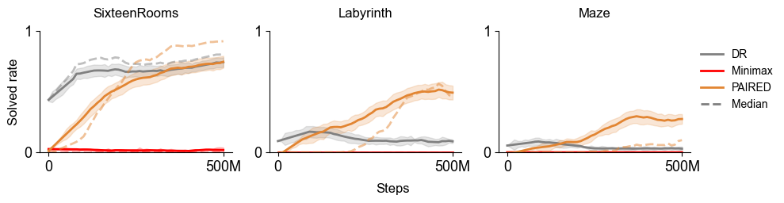

[](https://opensource.org/licenses/Apache-2.0)

# PAIRED

This codebase provides a PyTorch implementation of Protagonist Antagonist Induced Regret Environment Design (PAIRED), which was first introduced in ["Emergent Complexity and Zero-Shot Transfer via Unsupervised Environment Design" (Dennis et al, 2020)](https://arxiv.org/abs/2012.02096). This implementation comes integrated with the MiniGrid environment used in Dennis et al, 2020, as well as the MiniHack environment featured in  ["MiniHack the Planet: A Sandbox for Open-Ended Reinforcement Learning Research" (Samvelyan et al, 2021)](https://openreview.net/forum?id=skFwlyefkWJ).

Unsupervised environment design (UED) methods propose a curriculum of tasks or environment instances (*levels*) that aims to foster more sample efficient learning and robust policies. PAIRED performs unsupervised environment design (UED) using a three-player game among two student agents—the protagonist and antagonist—and an adversary. The antagonist is allied with the adversary, which proposes new environment instances (or *levels*) aiming to maximize the regret of the protagonist, estimated as the difference in returns achieved by the student agents across a batch of rollouts on proposed levels.

PAIRED has a strong guarantee of robustness in that at Nash equilibrium, it provably induces a minimax regret policy for the protagonist, which means that the protagonist optimally trades off regret across all possible levels that can be proposed by the adversary. 

### UED algorithms included

- PAIRED (Protagonist Antagonist Induced Regret Environment Design)
- Minimax
- Domain randomization

### Environments supported

- [MiniHack (Samvelyan et al, 2021)](https://github.com/facebookresearch/minihack)
- [MiniGrid (Chevalier-Boisvert et al, 2018)](https://github.com/maximecb/gym-minigrid)

## Set up
To install the necessary dependencies, run the following commands:

```
conda create --name paired python=3.8
conda activate paired
pip install -r requirements.txt

git clone https://github.com/openai/baselines.git
cd baselines
pip install -e .
cd ..

git clone https://github.com/facebookresearch/minihack.git
cd minihack
pip install -e .
cd ..
```

## Configuration
Detailed descriptions of the various command-line arguments for the main training script, `train.py` can be found in [`arguments.py`](https://github.com/ucl-dark/paired/blob/master/arguments.py).

## Experiments


For convenience, configuration json files are provided to generate the commands to run the specific experimental settings featured in Dennis et al, 2020 and Samvelyan et al, 2021. To generate the command to launch 1 run of the experiment codified by the configuration file `config.json` in the local folder `train_scripts/configs`, simply run the following, and copy and paste the output into your command line. 
```shell
python train_scripts/make_cmd.py --json config --num_trials 1
```

Alternatively, you can run the following to copy the command directly to your clipboard:

```shell
python train_scripts/make_cmd.py --json config --num_trials 1 | pbcopy
```

By default, each experiment run will generate a folder in `~/logs/paired` named after the `--xpid` argument passed into the the `train` command. This folder will contain log outputs in `logs.csv` and periodic screenshots of generated levels in the directory `screenshots`. Each screenshot uses the naming convention `update_<number of PPO updates>.png`. The latest model checkpoint will be output to `model.tar`, and archived model checkpoints are also saved according to the naming convention `model_<number of PPO updates>.tar`.

The json files for reproducing various MiniGrid and MiniHack experiments from Dennis et al, 2020 and Samvelyan et al, 2021 are listed below:

### MiniGrid experiments

| Method        | json config  |
| ------------- |:-------------|
| PAIRED| minigrid/paired.json |
| Minimax |minigrid/minimax.json|
| DR | minigrid/dr.json |

### MiniHack experiments
| Method        | json config  |
| ------------- |:-------------|
| PAIRED | minihack/paired.json |
| Minimax | minihack/minimax.json |
| DR | minihack/dr.json |

## Evaluation
You can use the following command to batch evaluate all trained models whose output directory shares the same `<xpid_prefix>` before the indexing `_[0-9]+` suffix:

```shell
python -m eval \
--base_path "~/logs/paired" \
--prefix '<xpid prefix>' \
--num_processes 2 \
--env_names \
'MultiGrid-SixteenRooms-v0,MultiGrid-Labyrinth-v0,MultiGrid-Maze-v0'
--num_episodes 100 \
--model_tar model
```
